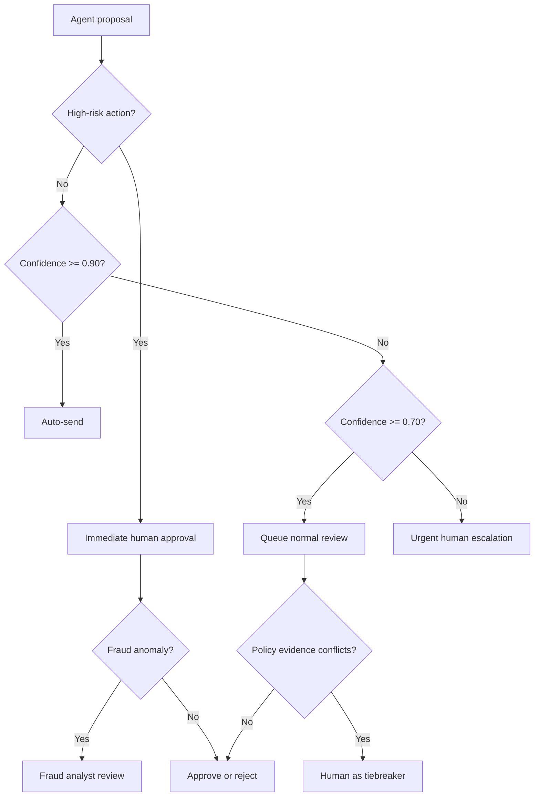

# Day 11 - HITL Flowchart

| Decision point | Trigger | HITL model | Reviewer context |
|---|---|---|---|
| High-value transaction | Transfer above 50,000,000 VND or new beneficiary | Human-in-the-loop | Identity, amount, beneficiary, fraud score, recent activity |
| Fraud/account takeover | Unusual device, location, velocity, or failed authentication | Human-on-the-loop | Device history, login geography, timeline, model explanation |
| Policy ambiguity | Medium confidence or conflicting policy evidence | Human-as-tiebreaker | Conversation, policy versions, citations, confidence, proposed response |
